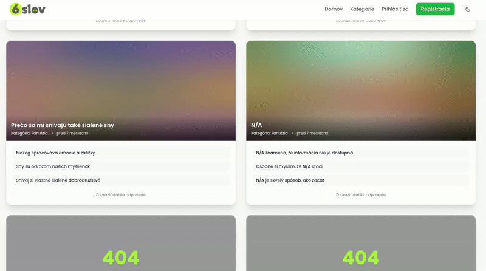

# Progressive Image Bundle

[](https://github.com/tito10047/progressive-image-bundle/actions)
[](https://packagist.org/packages/tito10047/progressive-image-bundle)
[](LICENSE)
[](https://php.net)
[](https://symfony.com/)
[](https://coveralls.io/github/tito10047/progressive-image-bundle?branch=main)


### High-performance progressive image loading for Symfony.
Deliver lightning-fast user experiences by serving beautiful Blurhash placeholders while high-resolution images load in the background, eliminating layout shifts and boosting SEO.

```twig
<twig:pgi:Image src="images/hero.jpg" alt="Amazing Landscape" >Image Not Found</twig:pgi:Image>
```



## 🚀 Key Features

### Core Features
-   **Smart Responsive Strategy:** Breakpoint-First approach with built-in **Upscale Protection**. Never serve blurry upscaled images again.
-   **Smart Preload Injection:** Automatically injects `<link rel="preload">` tags or HTTP headers for hero images, boosting LCP scores by eliminating "indirect discovery".
-   **Zero CLS (Cumulative Layout Shift):** Automatically extracts and injects image dimensions to reserve space, ensuring a stable layout during loading.

### Other Features
-   **Smart Metadata Extraction:** Uses PHP Streams to read only the necessary bytes for dimensions and hashes—no more loading 20MB images into RAM.
-   **Modern Frontend Stack:** Built on **Symfony UX Twig Components** and **Stimulus** for a seamless, reactive developer experience.
-   **Cloud-Ready Architecture:** Flexible `LoaderInterface` supports local files, network drives, and S3 (via custom loaders).
-   **Advanced Path Resolution:** Resolve images via Filesystem, AssetMapper, or a custom Chain resolver.
-   **Developer Experience (DX):** Simple `<twig:pgi:Image>` component with full support for custom attributes, filters, and decorators (e.g., LiipImagine).

## 📦 Installation

Install the bundle via Composer:

```console
composer require tito10047/progressive-image-bundle
```

If you are not using Symfony Flex, register the bundle manually:

```php
// config/bundles.php
return [
    // ...
    Tito10047\ProgressiveImageBundle\ProgressiveImageBundle::class => ['all' => true],
];
```

## ⚙️ Configuration
This configuration is optional,
create `config/packages/progressive_image.yaml` to configure your resolvers and loaders.

```yaml
progressive_image:
    # Define how to locate your images
    resolvers:
        public_files:
            type: "filesystem"
            roots: ['%kernel.project_dir%/public']
            allowUnresolvable: true
            
        assets:
            type: "asset_mapper"
            
        # Try multiple resolvers in order
        chain:
            type: "chain"
            resolvers:
                - 'public_files'
                - 'assets'

    # Global settings
    driver: "gd"          # Image processor: "gd" or "imagick"
    loader: "progressive_image.filesystem.loader" # Service ID for loading file streams
    resolver: "chain"     # Default resolver to use
    cache: "app.cache.progressive_image" # Recommended to use a persistent cache

    # Resolution for the generated Blurhash
    hash_resolution:
        width: 10
        height: 8

    # Integrations
    path_decorators:
        - "progressive_image.decorator.liip_imagine" # Enable LiipImagine support

when@dev:
    progressive_image:
        resolver: chain
```

## 🎨 Usage

Simply use the provided Twig component in your templates. The component automatically handles the placeholder generation and Stimulus controller initialization.

```twig
{# Simple usage #}
<twig:pgi:Image src="images/hero.jpg" alt="Amazing Landscape" />

{# Optimize LCP by preloading the image #}
<twig:pgi:Image src="images/hero.jpg" preload />

{# With custom attributes and LiipImagine filter #}
<twig:pgi:Image 
    :context="{ 'filter': 'my_liip_filter' }"
    src="uploads/portrait.png" 
    alt="User Profile"
    class="rounded-full shadow-lg"
    style="border: 2px solid #fff;"
/>
```

## 🚀 Smart Responsive Strategy
Stop managing magic pixel numbers. This bundle introduces a Breakpoint-First approach with built-in Upscale Protection.

### 1. Define once, use everywhere
Instead of hardcoding widths in every template, define your project's grid in a central configuration. Use meaningful aliases like `sm`, `md`, or `xl`.

```yaml
# config/packages/progressive_image.yaml
progressive_image:
    responsive_strategy:
        breakpoints:
            sm: 480
            md: 800
            lg: 1200
            xl: 1920
        
        fallback_widths: [ sm, md, lg, xl ] # Default srcset
        
        presets:
            article_hero:
                widths: [ md, lg, xl ]
                sizes: "(max-width: 1024px) 100vw, 1024px"
```

### 2. Intelligence: Built-in Upscale Protection

The bundle never generates an image larger than the original source. For example, if you have a preset requesting `xl` (1920px) but the user uploads a 1000px image:
- The bundle automatically filters out 1200px and 1920px variants.
- It serves the 800px (`md`) and the 1000px (original) instead.

**Result:** No blurry upscaled images, saved CPU cycles, and reduced storage waste.

### 3. Seamless Twig Integration
Using complex responsive logic is now as simple as naming a preset.

### LiipImagine Integration & Automatic Filter Generation

If you use [LiipImagineBundle](https://github.com/liip/LiipImagineBundle), this bundle can automatically generate the necessary `filter_sets` for your responsive breakpoints.

When you define breakpoints in `progressive_image`, the bundle analyzes your existing `liip_imagine` configuration and creates new filter variants for each breakpoint (except for the `cache` set).

#### How it works:
1. **Naming:** For a filter named `preview_big`, it generates `preview_big_sm`, `preview_big_md`, etc.
2. **Smart Sizing:** If the original filter contains a `thumbnail` filter, the bundle automatically sets the `size` to match the breakpoint width while **preserving the original aspect ratio** (e.g., `[480, 270]` for a 16:9 source filter and `sm: 480`).
3. **Inheritance:** All other settings like `quality`, `format`, and `post_processors` are preserved from the parent filter.

#### Example:
```yaml
progressive_image:
    responsive_strategy:
        breakpoints:
            sm: 480
            md: 800

liip_imagine:
    filter_sets:
        preview_big:
            quality: 75
            filters:
                thumbnail: { size: [ 500, 500 ], mode: outbound }
            post_processors:
                cwebp: { q: 75, m: 6 }
```

The bundle will automatically "prepend" these configurations to LiipImagine:
```yaml
liip_imagine:
    filter_sets:
        preview_big_sm:
            quality: 75
            filters:
                thumbnail: { size: [ 480, 480 ], mode: outbound }
            post_processors: { cwebp: { q: 75, m: 6 } }
        preview_big_md:
            quality: 75
            filters:
                thumbnail: { size: [ 800, 800 ], mode: outbound }
            post_processors: { cwebp: { q: 75, m: 6 } }
```
```twig
{# Automatically handles srcset, sizes, and upscale protection #}
<twig:pgi:Image src="blog/hero.jpg" preset="article_hero" />
```


## ⚡ Smart Preload Injection (LCP Optimization)

One of the biggest challenges for Core Web Vitals (LCP) is the "Indirect Discovery" of images. If your hero image is hidden behind a component or managed by JavaScript, the browser's preload scanner won't find it fast enough.

This bundle solves this by implementing a **Dependency Discovery Pattern**:
1. **Collection:** While Twig renders your components, the bundle automatically collects the URLs of images marked with the `preload` attribute.
2. **Injection:** A Kernel Response Listener intercepts the final response and injects `<link rel="preload">` tags directly into the HTML `<head>` (or as HTTP Link headers) before it's sent to the user.

**Key Benefits:**
- **Zero-Config:** Just add the `preload` attribute, and the bundle handles the complex logic of moving links to the head.
- **Native Performance:** Supports both HTML injection and HTTP/2 Link Headers for even faster delivery.

## 🏗️ Architecture

### Stream-based Approach
Unlike traditional tools that load the entire image into memory to get dimensions, this bundle uses **PHP Streams**. By interacting with the `LoaderInterface`, we can peek at the image headers to extract metadata (Width, Height, MIME type, and Blurhash). 

This is particularly critical when handling:
- **Large Files:** Avoid `Memory Limit Exceeded` errors on 50MB+ source files.
- **S3 / Network Drives:** Only download the minimal required bytes over the wire instead of the full file, significantly reducing latency and bandwidth costs.

### Extensibility
- **Loaders:** Implement `LoaderInterface` to fetch images from any source (GCS, Azure Blob, External APIs).
- **Resolvers:** Implement `PathResolverInterface` to customize how logical paths are mapped to physical locations.
- **Decorators:** Modify the final image URL (e.g., adding CDN prefixes or image manipulation parameters).

## 📄 License

The MIT License (MIT). Please see [License File](LICENSE) for more information.
