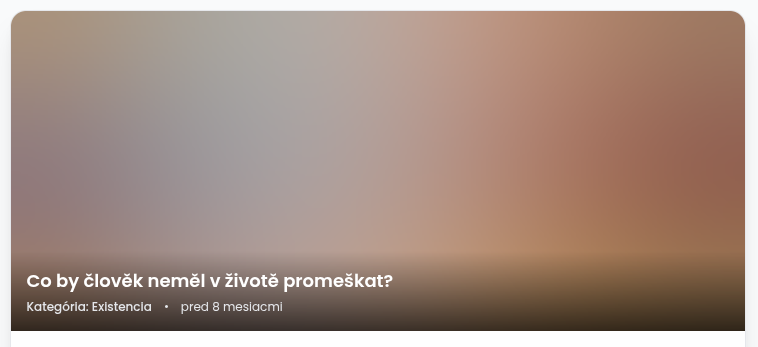

# Solving the Image Problem in Symfony: Meet PGI

Images are the heaviest part of the modern web. They are responsible for slow page loads, frustrating Cumulative Layout Shift (CLS), and a nightmare developer experience
when trying to implement truly responsive designs. If you’ve ever wrestled with complex `<picture>` tags or manually calculated `srcset` values for different breakpoints,
you know the pain.

Enter **PGI** (Progressive Image Bundle)—the new standard for image handling in Symfony 6.4 and newer versions.

## The Hook: Why Core Web Vitals Changed Everything

Google’s Core Web Vitals—specifically Largest Contentful Paint (LCP) and Cumulative Layout Shift (CLS)—have transformed how we build websites. It’s no longer enough to
just "show an image." You need to show it fast, and you must ensure the layout doesn’t jump when the image finally appears.

For many Symfony developers, achieving a perfect 100/100 PageSpeed score while maintaining a clean codebase has felt like a trade-off. You either spend hours writing
custom responsive logic or you settle for "good enough" performance. PGI was born to eliminate that trade-off.

## Code Showcase: From Messy to Masterful

Let’s look at the difference. A standard responsive image in Twig often looks like this:

```twig

```

And that’s just for *one* aspect ratio. With PGI, you get a clean, Tailwind-inspired syntax:

```twig
<twig:pgi:Image 
    src="images/hero.jpg" 
    sizes="sm:12@square md:6@landscape"
    alt="Responsive hero image" 
    preload
/>
```

### Real-world Case: 6slov.sk

To see PGI in action, let's look at how it handles a single image across different devices using an example from [6slov.sk](https://6slov.sk/).

Instead of writing multiple `` tags or complex `<picture>` logic, you define everything in one place:

```twig
<twig:pgi:Image 
    src="realcase.jpg" 
    sizes="sm:12@square md:6@landscape" 
    alt="Responsive real-world example"
/>
```

#### What happens on different devices?

1. **Mobile (sm):** The browser loads a **Square (1:1)** crop. It takes the full width of the container.
2. **Tablet/Desktop (md+):** The browser automatically switches to a **Landscape (16:9)** crop. The image now occupies only half of the grid (6/12 columns).

**Visual Result:**
| Mobile (sm) - Square | Tablet/Desktop (md) - Landscape |
| :--- | :--- |
|  |  |

#### Rendered HTML (Clean & Semantic)

PGI generates a single, optimized block of HTML that handles all the heavy lifting, including the **Blur Placeholder**:

```html
<div class="progressive-image-container" 
     style="--img-width-sm: 640px; --img-aspect-sm: 1; --img-width-md: 384px; --img-aspect-md: 1.7777777777778;" ...>
    <canvas data-tito10047--progressive-image-bundle--progressive-image-target="placeholder" ...></canvas>
    
</div>
```

### What's happening here?

- **`sm:12@square`**: Full width on small screens, automatically cropped to 1:1.
- **`md:6@landscape`**: Half width (6/12 columns) from medium breakpoint, automatically cropped to 16:9.
- **`xl:[430x370]`**: Need a very specific size for a custom layout? PGI supports arbitrary values directly in the `sizes` attribute.
- **`preload`**: PGI automatically injects a `<link rel="preload">` into your `<head>`, optimizing your LCP score instantly.

### The "Progressive" in PGI: Blur-up Experience

One of the most satisfying features for users is the built-in **Blurhash** support. Instead of showing a blank space or a generic spinner, PGI renders a beautiful,
ultra-lightweight blurred version of the image immediately.



This "blur-up" technique significantly improves **perceived performance**. Users see the layout and the context of the image instantly, even on slow connections, while
the high-resolution version loads in the background. Once ready, the high-res image smoothly fades in, replacing the placeholder.

## Technical Deep Dive: Zero CLS and CSS Magic

How does PGI prevent layout shift? It’s not just about adding `width` and `height` attributes. PGI leverages modern CSS `aspect-ratio` and CSS variables.

When the component renders, it calculates the aspect ratio based on your `sizes` definition. It then wraps the image in a container that reserves the exact space needed.
No more content jumping as images load—even if the image is lazy-loaded or slow to arrive.

### Powering the Engine: LiipImagine Integration

PGI doesn't reinvent the wheel for image processing. Instead, it stands on the shoulders of a giant: **LiipImagineBundle**. By default, PGI can delegate the heavy lifting
of resizing and filtering to LiipImagine, allowing you to leverage its full ecosystem.

One of the most powerful features of this synergy is the **automatic conversion to modern formats like WebP**. With just a few lines of configuration, you can ensure that
every image served by PGI is not only perfectly sized but also perfectly compressed.

**Example Configuration:**

```yaml
# config/packages/liip_imagine.yaml
liip_imagine:
    default_filter_set_settings:
        format: webp
    webp:
        generate: true

# config/packages/progressive_image.yaml
progressive_image:
    image_configs:
        quality: 75
        post_processors:
            cwebp: { q: 30 }
```

By using the `liip_imagine` decorator, PGI automatically routes image requests through LiipImagine's filter system. This means you can use all your existing Liip filters
while benefiting from PGI's superior Twig syntax and Zero CLS features.

## Under the Hood: The Configuration That Makes It Possible

One of the most praised aspects of PGI is its flexibility. While it works out-of-the-box, the real power lies in its configuration. Let’s break down the most important
parts of `progressive_image.yaml`:

```yaml
# config/packages/progressive_image.yaml
progressive_image:
    # 1. Responsive Strategy
    responsive_strategy:
        grid:
            framework: tailwind # or bootstrap, or custom
        ratios:
            landscape: "16/9"
            square: "1/1"
            hero: "21/9"

    # 2. Resolvers (Where are your images?)
    resolvers:
        public_files:
            type: "filesystem"
            roots: [ '%kernel.project_dir%/public' ]
        assets:
            type: "asset_mapper"

    # 3. Transparent HTML Caching
    image_cache_enabled: true
    image_cache_service: "cache.app"
```

### 1. Responsive Strategy

This is the brain of PGI. By telling the bundle you use **Tailwind** or **Bootstrap**, it automatically knows the container widths for every breakpoint. When you say
`md:6`, PGI looks up the `md` container width, divides it by 2 (6/12 columns), and generates the exact image size needed.

### 2. Resolvers: File Freedom

Whether you keep your images in the `public/` folder or use the modern **Symfony AssetMapper**, PGI can find them. You can even define a `chain` resolver to look in
multiple places. This is a lifesaver for projects transitioning to newer Symfony features.

### 3. Performance First: HTML Caching

Generating Blurhash and reading metadata requires CPU power. PGI solves this with **transparent HTML caching**. Once a component is rendered, the final HTML is stored in
your cache. The next time someone visits the page, PGI serves the cached HTML instantly, skipping all PHP logic.

### Point of Interest (PoI) Cropping

One of the coolest features is "Smart Cropping." Instead of blindly cropping from the centre, you can define a Point of Interest as pixel coordinates in the original image:

```twig
<twig:pgi:Image src="team.jpg" pointInterest="544x320" sizes="md:6@square" />
```

`544x320` means 544 pixels from the left and 320 pixels from the top of the original image. The bundle finds the largest region that matches the requested output ratio, centres it on that point, and scales the result down — so a person's face, for example, stays in frame regardless of whether the output is square, portrait, or landscape.

## Why PGI Belongs in Your Next Project

PGI isn't just a wrapper; it's a complete ecosystem for Symfony:

- **Zero Configuration:** Install and it just works with Bootstrap or Tailwind.
- **Automatic Generation:** It generates all required sizes on the fly and caches them.
- **LiipImagine Integration:** It plays nice with existing tools if you need custom filters.
- **Transparent Caching:** It can cache the resulting HTML to avoid re-calculating metadata on every request.

If you are building a modern Symfony application and care about SEO, UX, and your own sanity as a developer, PGI is the missing piece of the puzzle. It’s already powering
high-performance sites like [6slov.sk](https://6slov.sk/), helping them achieve near-perfect PageSpeed scores.

**Ready to boost your PageSpeed?**
[Check out PGI on GitHub](https://github.com/tito10047/progressive-image-bundle) and join the movement toward a faster, more stable web.
